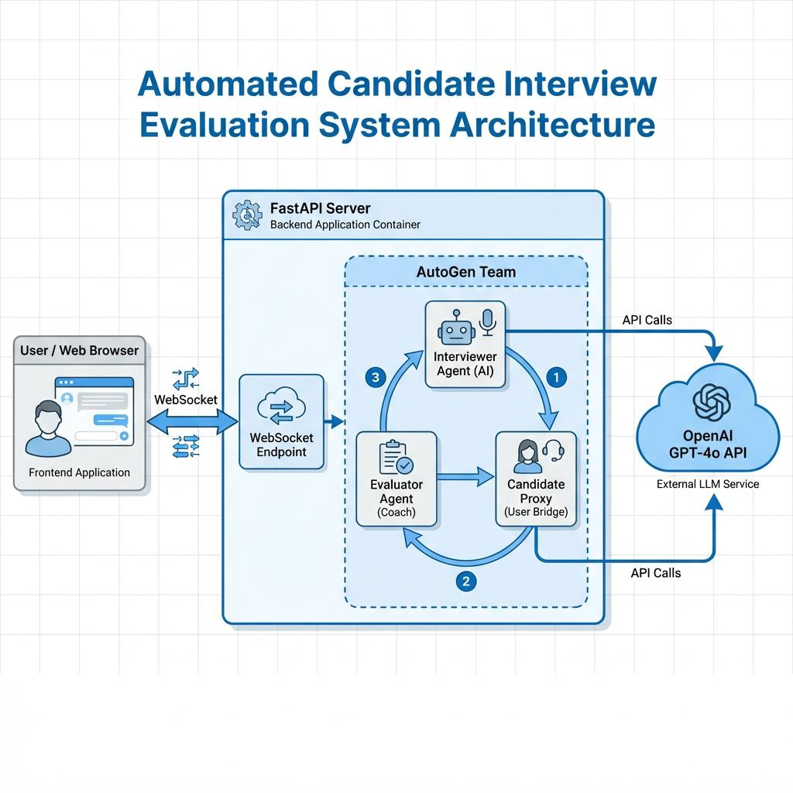

# 🎯 Automated Candidate Interview Evaluation System

[](https://www.python.org/)
[](https://fastapi.tiangolo.com/)
[](https://openai.com/)
[](LICENSE)
[](README.md)

## 📋 Overview

An intelligent, AI-powered interview evaluation system that automates the candidate interview process. The system uses multi-agent AI (AutoGen) to conduct interviews, evaluate responses in real-time, and provide comprehensive feedback on candidate performance.

### 🌟 Key Highlights
- **AI-Powered Interviews**: Uses GPT-4o for intelligent question generation and evaluation
- **Multi-Agent Architecture**: Interviewer and Evaluator agents collaborate seamlessly
- **Real-Time Feedback**: WebSocket-based live interview evaluation
- **Professional UI**: Responsive web interface for interview management
- **Vector Database**: Chroma DB for efficient candidate profile storage and retrieval

---

## ✨ Features

- ✅ **Automated Interview Orchestration**: Conducts structured technical and behavioral interviews
- ✅ **AI Evaluation System**: Real-time candidate response evaluation using LLMs
- ✅ **WebSocket Integration**: Live bidirectional communication between frontend and backend
- ✅ **Multi-Agent Collaboration**: Interviewer and Evaluator agents working together
- ✅ **Pydantic Validation**: Robust request/response model validation
- ✅ **Logging & Monitoring**: Comprehensive logging for debugging and observability
- ✅ **Memory Management**: Integration with Mem0 for context persistence
- ✅ **Query Validation**: Advanced query validation and transformation
- ✅ **Vector Database**: Chroma for semantic search capabilities

---

## 🏗️ System Architecture

The system follows a modular microservices-inspired architecture with clear separation of concerns:



**Key Components:**
- **Frontend Application**: Web-based UI for conducting interviews
- **FastAPI Server**: Backend REST API and WebSocket endpoint
- **AutoGen Team**: Multi-agent system for interview orchestration
  - **Interviewer Agent (AI)**: Conducts interviews with dynamic questioning
  - **Evaluator Agent (Coach)**: Evaluates candidate responses
  - **Candidate Proxy**: Acts as user bridge between UI and agents
- **OpenAI GPT-4o**: External LLM for AI decision making
- **Vector Database**: Chroma for profile and knowledge storage

---

## 📦 Project Structure

```
Automated-Candidate-Interview-Evaluation-System/
├── 📄 app.py                          # FastAPI main application
├── 📄 agent_test.py                   # Agent testing utilities
├── 📄 requirements.txt                # Python dependencies
├── 📄 README.md                       # Project documentation
├── 📁 all-utils/                      # Core utilities and models
│   ├── 📄 main.py                     # Utility orchestration
│   ├── 📄 requirements.txt            # Utility-specific dependencies
│   ├── 📁 utilities/                  # Helper modules
│   │   ├── 📔 1. Pydanctic Request & Response Model.ipynb
│   │   ├── 📔 2. Query Validation & Query Transformation.ipynb
│   │   ├── 📔 3. Logging.ipynb
│   │   ├── 📔 4. Mem0.ipynb
│   │   ├── 📄 pydantic_models.py      # Pydantic request/response models
│   │   ├── 📄 query_validation_transformation.py
│   │   ├── 📄 logging_example.py      # Logging demonstrations
│   │   └── 📄 mem0_example.py         # Memory management examples
│   └── 📁 db/                         # Vector database storage
│       └── chroma.sqlite3             # Chroma vector database
├── 📁 static/                         # Frontend static assets
│   ├── 📄 style.css                   # Styling
│   └── 📄 script.js                   # Frontend JavaScript
├── 📁 templates/                      # HTML templates
│   └── 📄 index.html                  # Main interview UI
├── 📁 Assets/                         # Project documentation assets
│   └── 📄 architecture_ywYBkwl.jpg    # Architecture diagram
└── 📁 docs/                           # Detailed documentation (generated)
```

---

## 🚀 Quick Start

### Prerequisites
- **Python 3.12+**
- **pip** or **conda**
- **OpenAI API Key**
- (Optional) **UV Package Manager** for faster dependency resolution

### Installation

#### Option 1: Using Conda (Recommended for Beginners)
```bash
# 1. Create a virtual environment
conda create -n interview_eval_env python=3.12 -y

# 2. Activate the virtual environment
conda activate interview_eval_env

# 3. Install dependencies
pip install -r requirements.txt
```

#### Option 2: Using UV (Recommended for Speed) ⚡
[UV](https://docs.astral.sh/uv/) is a blazing-fast Python package installer written in Rust. It can be 10-100x faster than pip!

```bash
# 1. Install UV (if not already installed)
pip install uv

# 2. Create and activate virtual environment with UV
uv venv interview_eval_env
source interview_eval_env/bin/activate  # On Windows: interview_eval_env\Scripts\activate

# 3. Install dependencies with UV (much faster!)
uv pip install -r requirements.txt
```

#### Option 3: Using venv (Built-in)
```bash
# 1. Create virtual environment
python -m venv interview_eval_env

# 2. Activate
# On Windows:
interview_eval_env\Scripts\activate
# On macOS/Linux:
source interview_eval_env/bin/activate

# 3. Install dependencies
pip install -r requirements.txt
```

### Environment Setup

Create a `.env` file in the project root:
```env
OPENAI_API_KEY=your_openai_api_key_here
```

### Running the Application

```bash
# Start the FastAPI server with auto-reload
uvicorn app:app --reload

# The application will be available at:
# - Main UI: http://localhost:8000
# - API Docs: http://localhost:8000/docs
# - ReDoc: http://localhost:8000/redoc
```

### Running Tests

```bash
# Run agent tests
python agent_test.py

# Run utility demonstrations
python all-utils/main.py
```

---

## 📚 Dependencies

### Core Dependencies
| Package | Purpose |
|---------|---------|
| `fastapi` | Web framework for building APIs |
| `uvicorn` | ASGI server for running FastAPI |
| `autogen-agentchat` | Multi-agent collaboration framework |
| `autogen-core` | Core AutoGen components |
| `autogen-ext` | Extended AutoGen utilities |
| `openai` | OpenAI API client |
| `pydantic` | Data validation using Python type hints |
| `websockets` | WebSocket protocol support |
| `python-dotenv` | Environment variable management |
| `jinja2` | Template engine |
| `tiktoken` | Token counting for OpenAI models |
| `aiofiles` | Async file operations |

See [requirements.txt](requirements.txt) for complete list with versions.

---

## 🔧 Configuration

### FastAPI Configuration
The application runs on `http://localhost:8000` by default. Modify the uvicorn command to change:
```bash
uvicorn app:app --host 0.0.0.0 --port 8000 --reload
```

### Database Configuration
The system uses Chroma vector database, located in `all-utils/db/`:
- `chroma.sqlite3`: Main database file
- Collection directories: Store embeddings and metadata

---

## 📖 Documentation

Comprehensive documentation is available in the `/docs` folder:
- [Installation Guide](docs/INSTALLATION.md)
- [Architecture Guide](docs/ARCHITECTURE.md)
- [API Reference](docs/API_REFERENCE.md)
- [Configuration Guide](docs/CONFIGURATION.md)
- [Development Guide](docs/DEVELOPMENT.md)

---

## 🔄 Workflow Diagrams

System workflows are documented with Mermaid diagrams in the `/workflows` folder:
- [Interview Flow](workflows/interview_flow.md)
- [Agent Communication](workflows/agent_communication.md)
- [Evaluation Process](workflows/evaluation_process.md)
- [WebSocket Lifecycle](workflows/websocket_lifecycle.md)

---

## 🤝 Contributing

Contributions are welcome! Please feel free to submit a Pull Request.

### Development Setup
```bash
# Install dev dependencies
pip install -r requirements.txt

# Run the application in development mode
uvicorn app:app --reload --log-level debug
```

---

## 📝 License

This project is licensed under the MIT License - see the [LICENSE](LICENSE) file for details.

---

## 🙋 Support

For questions or issues:
1. Check the [docs](docs/) folder for detailed guides
2. Review the [workflows](workflows/) folder for architecture diagrams
3. Open an issue on GitHub

---

## 🎓 Learning Resources

This project demonstrates:
- Multi-agent AI systems with AutoGen
- Real-time communication with WebSockets
- FastAPI best practices
- Pydantic data validation
- Vector database integration
- Professional Python project structure

---

**Happy interviewing! 🚀**


