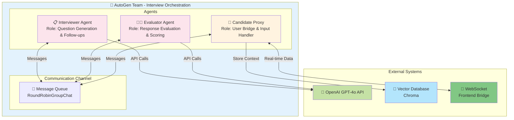
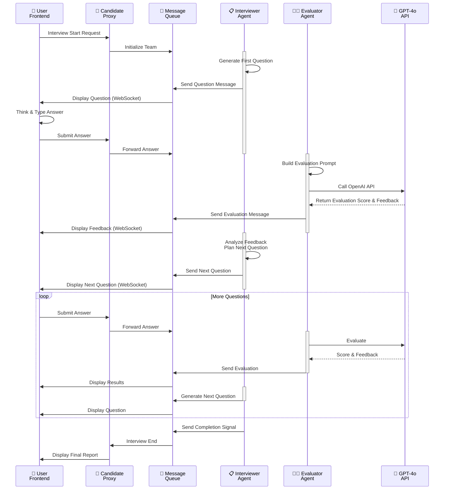
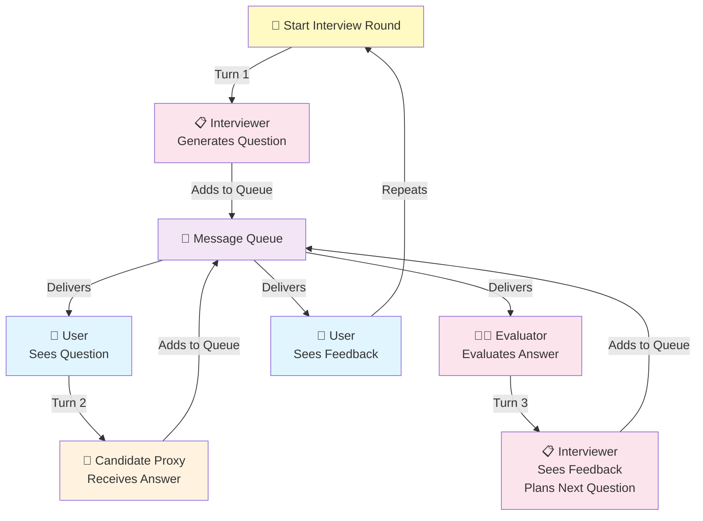
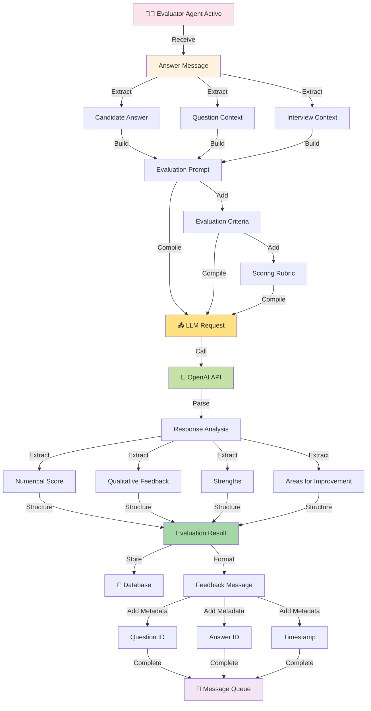
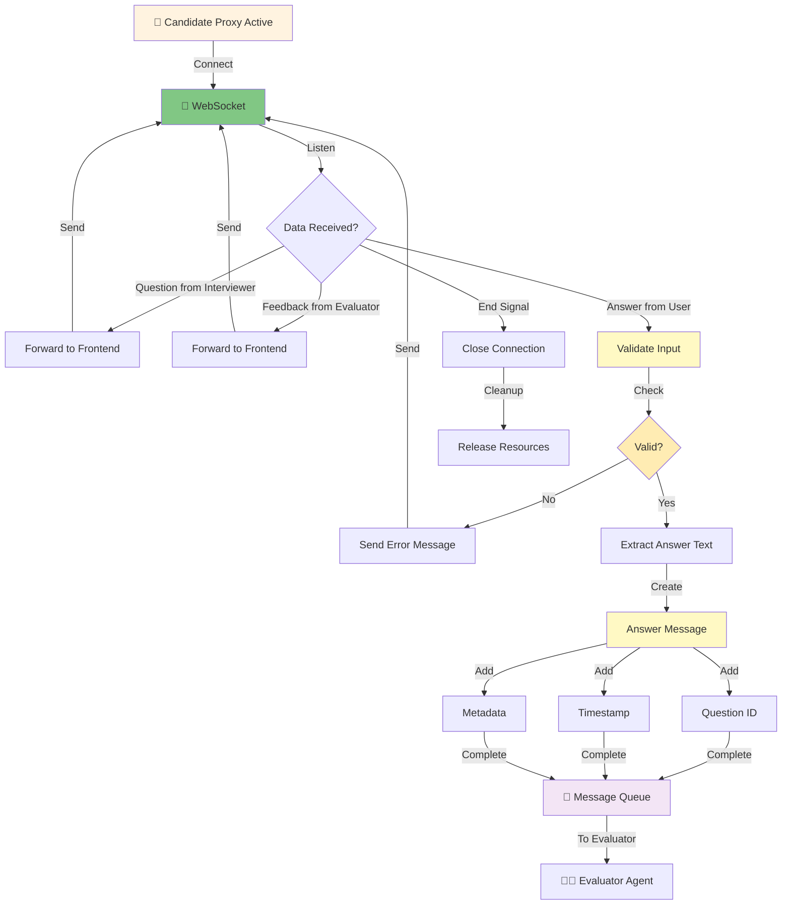
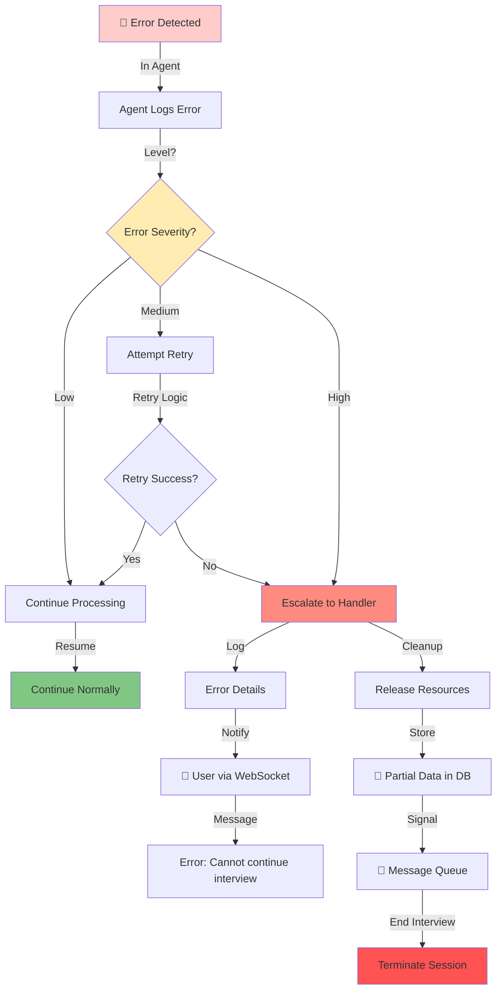
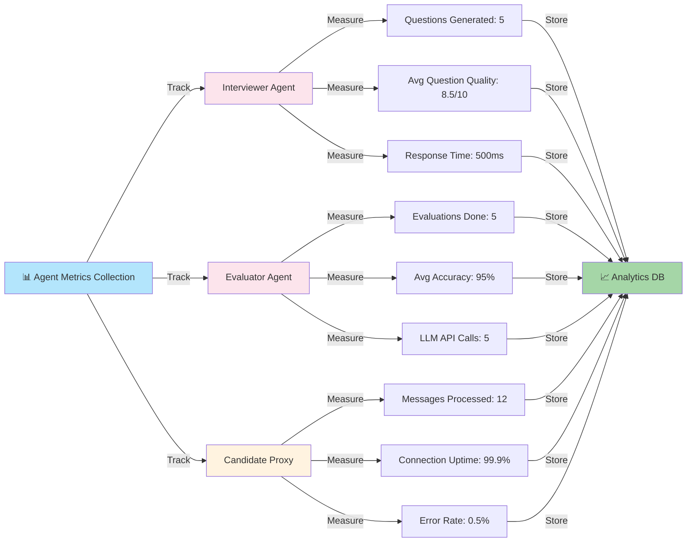

# Agent Communication Workflow

## Multi-Agent Architecture

## Agent Interaction Sequence

## Round-Robin Communication Pattern

## Interviewer Agent Behavior

```mermaid
graph TD
    A["📋 Interviewer Agent Active"]
    
    A -->|Receive| B{Message Type?}
    
    B -->|Start Signal| C["Initialize Interview Context"]
    C -->|Set| D["Job Position"]
    C -->|Set| E["Difficulty Level"]
    C -->|Set| F["Question Number"]
    
    D & E & F -->|Prepare| G["Generate First Question"]
    
    B -->|Feedback Message| H["Analyze Evaluator Feedback"]
    H -->|Check| I{Performance Level?}
    
    I -->|Excellent| J["Increase Difficulty"]
    I -->|Good| K["Maintain Difficulty"]
    I -->|Poor| L["Decrease Difficulty"]
    
    J & K & L -->|Plan| M["Generate Next Question"]
    
    B -->|End Signal| N["Prepare Completion Message"]
    
    G & M -->|Format| O["Question Message"]
    O -->|Add| P["Metadata"]
    P -->|Send| Q["📨 Message Queue"]
    
    N -->|Send| Q
    
    style A fill:#fce4ec
    style B fill:#ffecb3
    style G fill:#a5d6a7
    style M fill:#a5d6a7
    style Q fill:#f3e5f5
```

## Evaluator Agent Behavior

## Candidate Proxy Behavior

## Error Handling in Agent Communication

## Agent Performance Metrics

---

## Key Communication Principles

1. **Asynchronous Messaging**: Agents communicate via message queue
2. **Round-Robin Turn-Taking**: Each agent gets its turn
3. **Context Preservation**: Full interview context maintained
4. **Error Isolation**: Errors in one agent don't crash others
5. **Real-Time Updates**: User sees all updates via WebSocket
6. **Scalability**: Can add more agents without breaking system

