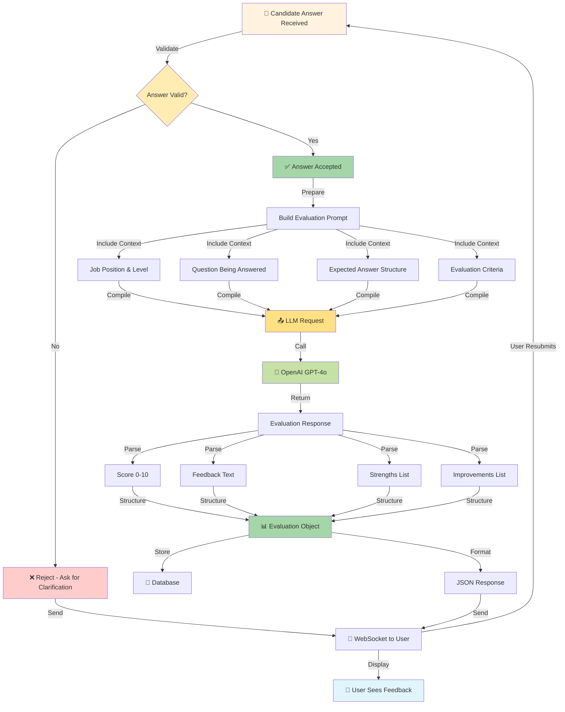
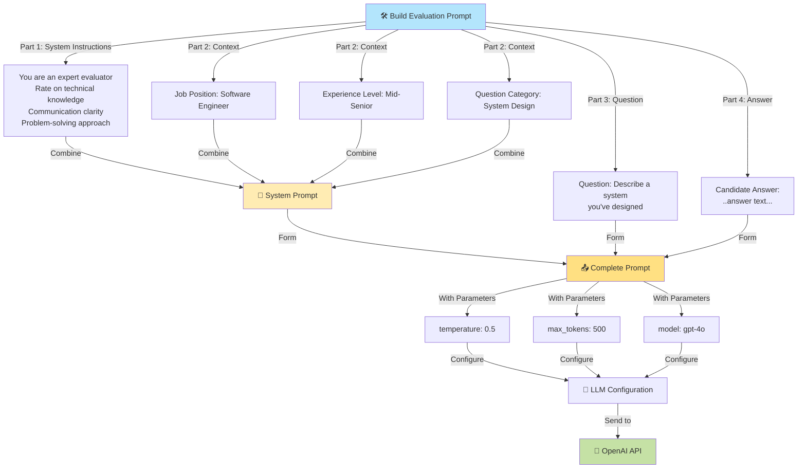
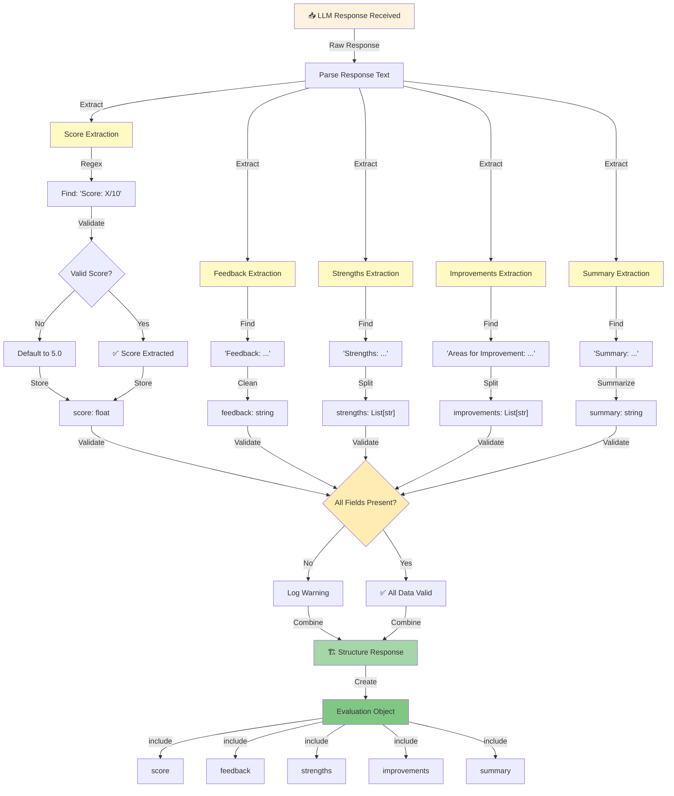
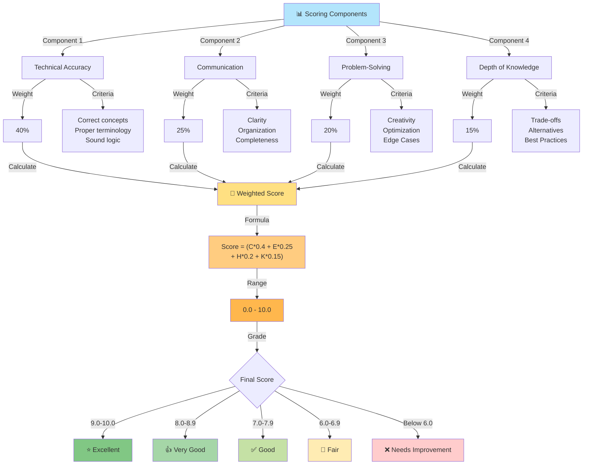
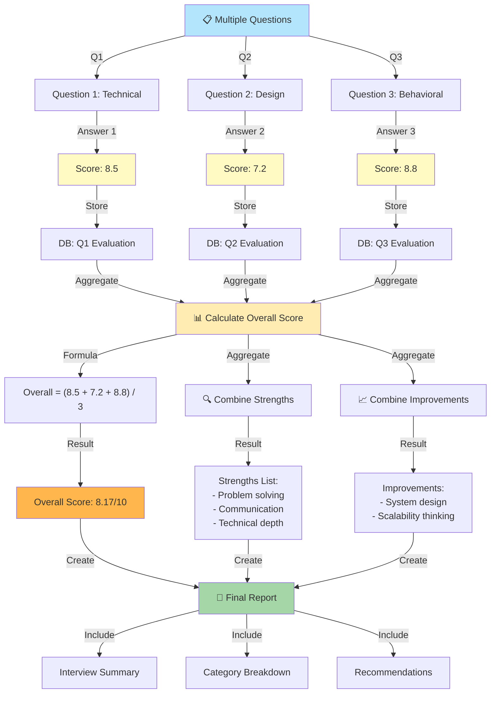
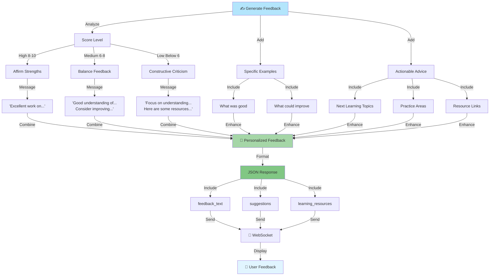
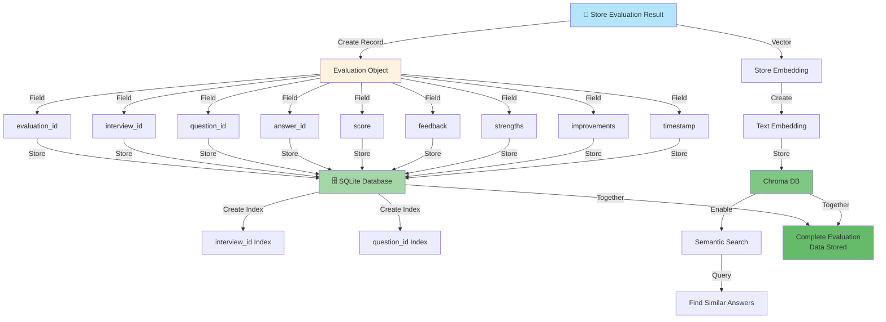
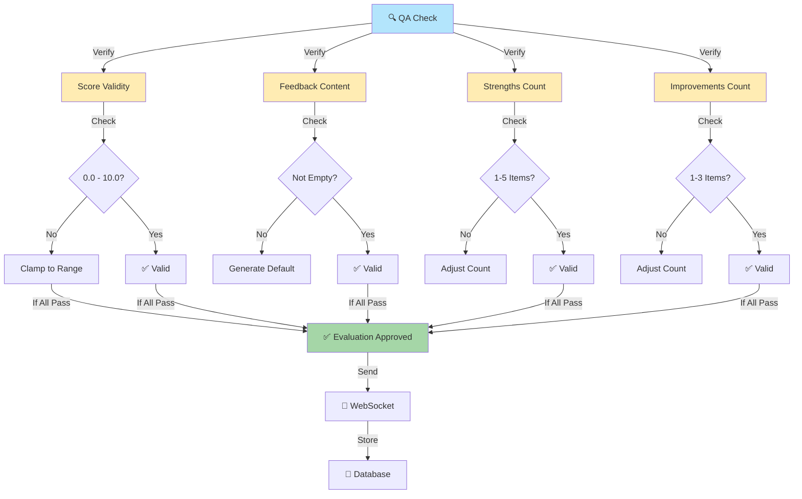

# Evaluation Process Workflow

## High-Level Evaluation Process

## Evaluation Prompt Construction

## Response Parsing & Structuring

## Scoring Methodology

## Multi-Question Evaluation Aggregation

## Feedback Generation Flow

## Evaluation Database Storage

## Quality Assurance in Evaluation

---

## Notes

- Evaluations are stored immediately for data persistence
- Scores are normalized to 0-10 scale for consistency
- Feedback is personalized based on score level
- Multiple evaluations aggregated for final report
- Vector embeddings enable semantic search and analytics

