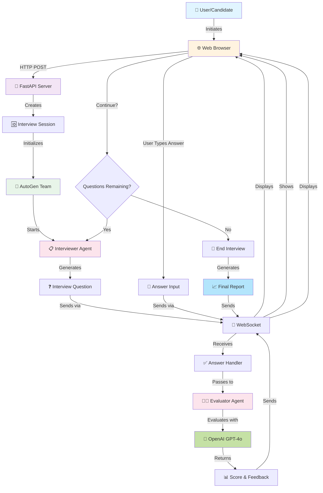
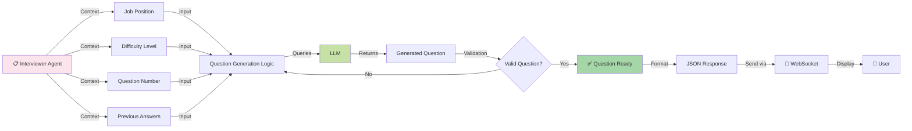
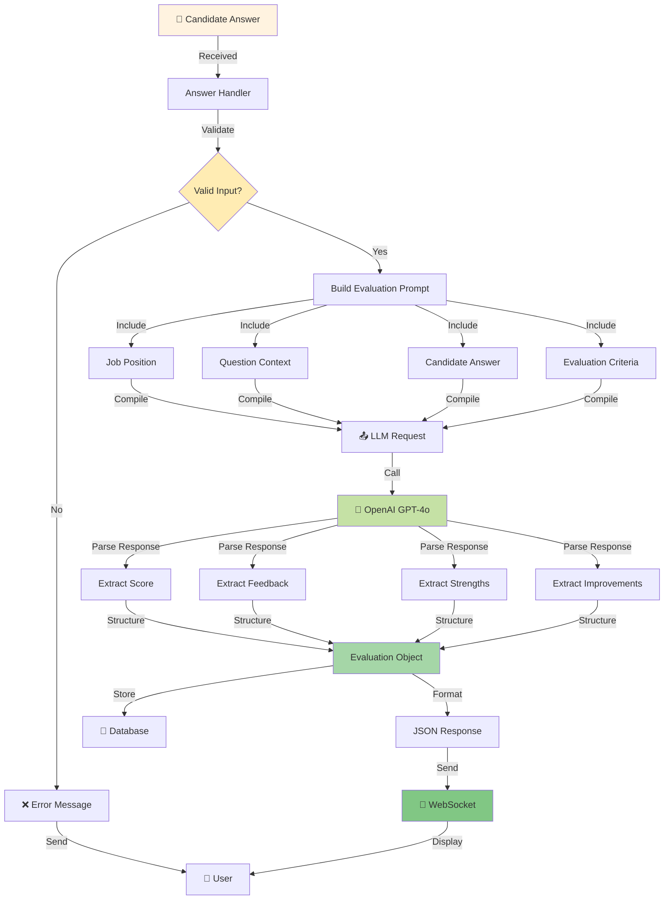
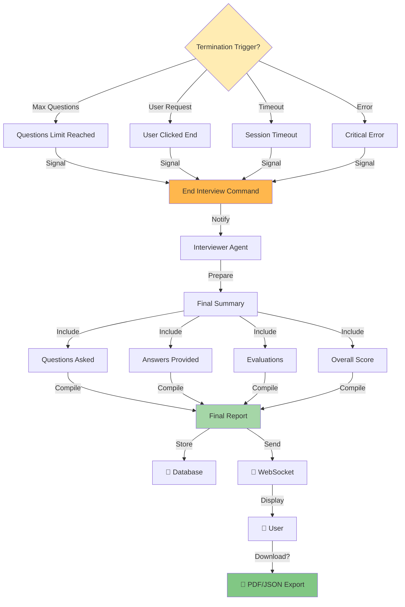

# Interview Flow Workflow

## Overall Interview Process



## Detailed Interview Loop

```mermaid
sequenceDiagram
    participant User as 👤 User
    participant Frontend as 🌐 Frontend
    participant Backend as 🚀 Backend
    participant Interviewer as 📋 Interviewer Agent
    participant Evaluator as 👨‍⚖️ Evaluator Agent
    participant LLM as 🤖 OpenAI GPT-4o
    participant DB as 💾 Database

    User->>Frontend: Start Interview
    Frontend->>Backend: POST /interview/start
    Backend->>DB: Create Interview Record
    Backend->>Interviewer: Initialize Agent
    
    loop Interview Questions
        Interviewer->>Interviewer: Generate Question
        Interviewer->>Frontend: Send Question (WebSocket)
        Frontend->>User: Display Question
        
        User->>Frontend: Enter Answer
        Frontend->>Backend: Send Answer (WebSocket)
        Backend->>Evaluator: Evaluate Answer
        
        Evaluator->>LLM: Call API with Answer
        LLM->>Evaluator: Return Evaluation
        Evaluator->>DB: Store Evaluation
        
        Evaluator->>Frontend: Send Feedback (WebSocket)
        Frontend->>User: Display Feedback
        
        alt Continue Interview
            Interviewer->>Interviewer: Adjust Next Question
        else End Interview
            break Interview Complete
        end
    end
    
    Interviewer->>Backend: Interview Complete
    Backend->>DB: Generate Final Report
    Backend->>Frontend: Send Final Report
    Frontend->>User: Display Results
```

## Question Generation Flow



## Answer Evaluation Flow



## Interview Termination



---

## Notes

- The interview process is fully asynchronous for real-time responsiveness
- Questions can adapt based on previous answers
- All interactions are stored in the database for analytics
- WebSocket ensures low-latency communication
- LLM calls are optimized with proper prompting

