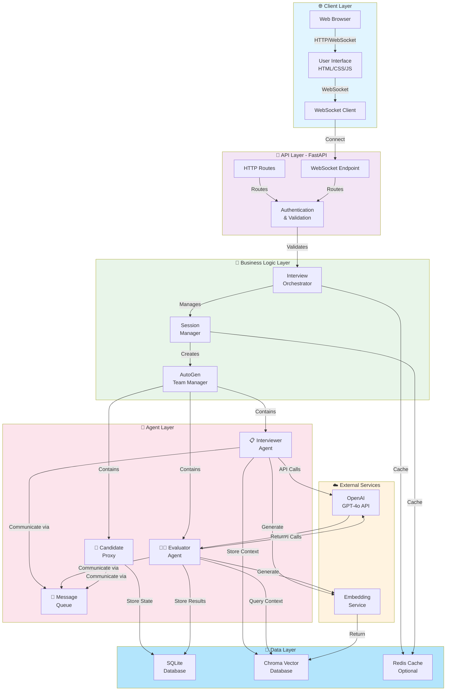
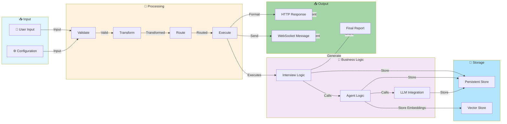
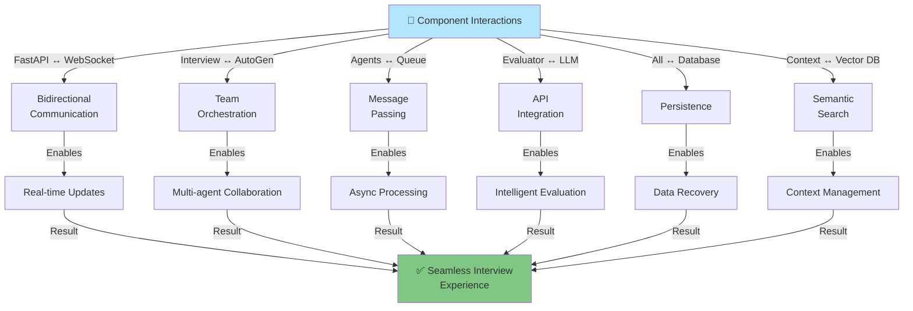
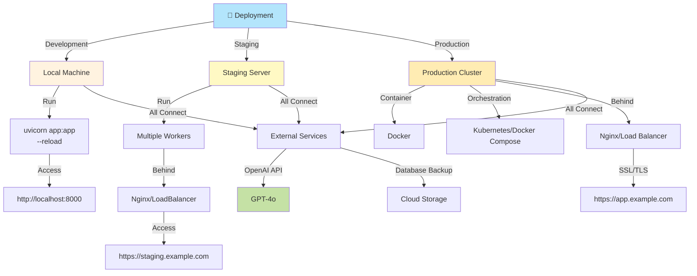

# System Architecture Overview

## Complete System Architecture

## Data Flow Diagram

## Component Interaction Matrix

## Deployment Architecture

---

## Architecture Principles

1. **Separation of Concerns**: Each layer has distinct responsibility
2. **Asynchronous Processing**: Non-blocking operations throughout
3. **Scalability**: Horizontal scaling support via load balancing
4. **Resilience**: Error handling and recovery mechanisms
5. **Observability**: Logging and monitoring at each layer
6. **Security**: Input validation, authentication, encryption
7. **Maintainability**: Clear module structure and documentation

