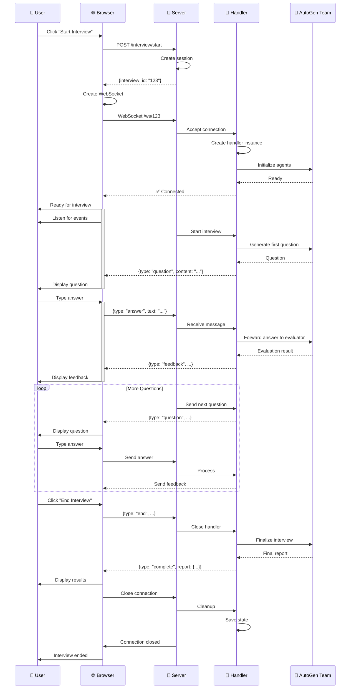
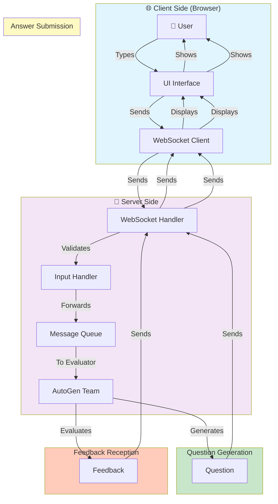
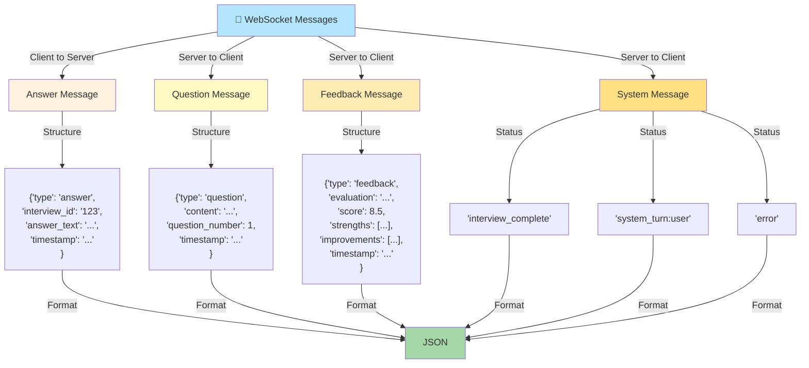
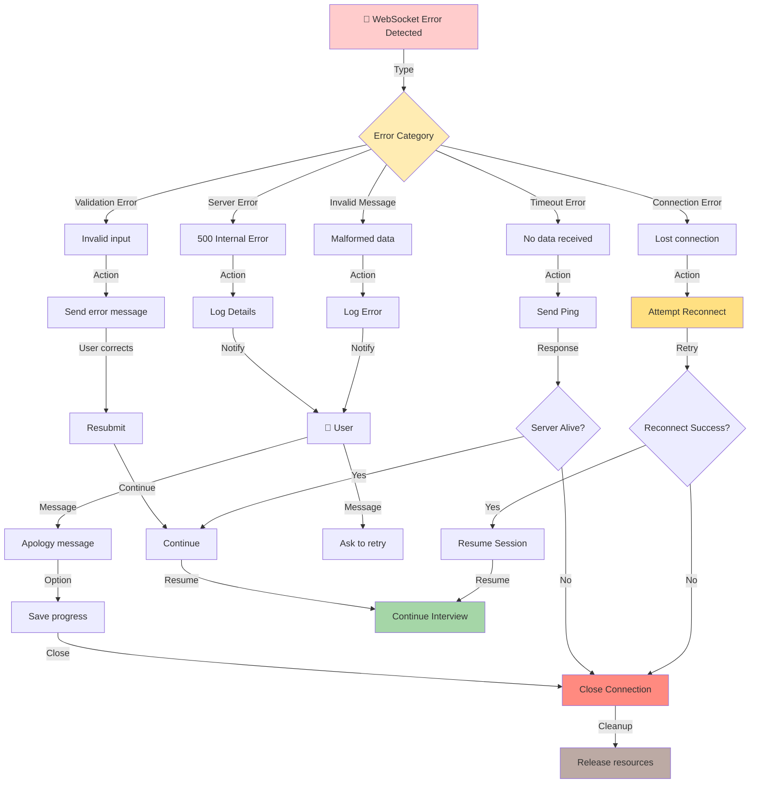
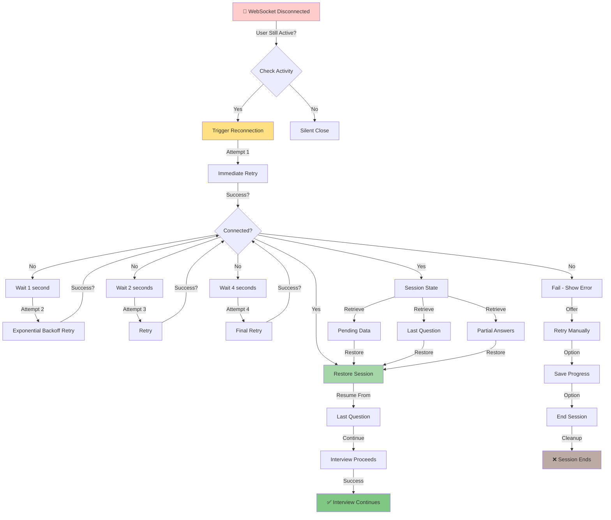
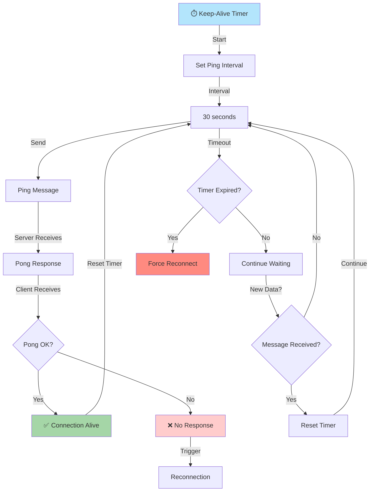
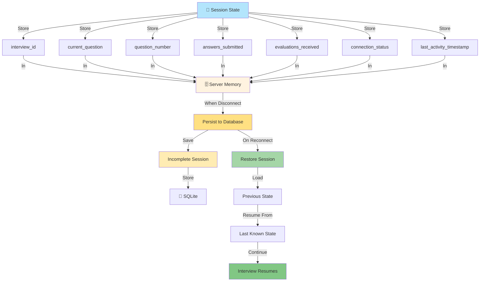
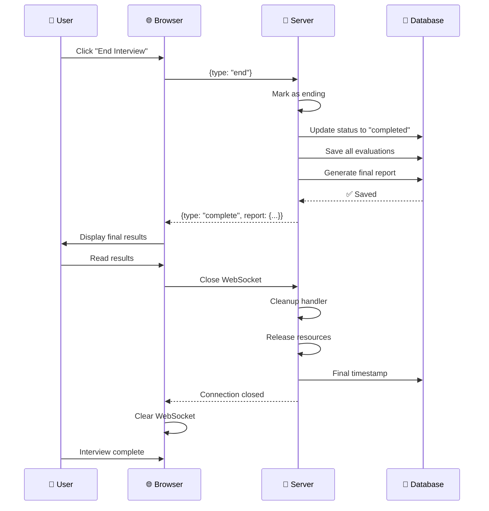

# WebSocket Lifecycle Workflow

## WebSocket Connection Lifecycle

```mermaid
stateDiagram-v2
    [*] --> Unconnected
    
    Unconnected -->|User initiates interview| Connecting
    
    Connecting -->|Server accepts| Connected
    Connecting -->|Connection rejected| Error
    
    Connected -->|User active| Active
    Connected -->|Idle timeout| TimedOut
    
    Active -->|Send answer| Processing
    Active -->|No activity| Idle
    
    Processing -->|Evaluation complete| Active
    Processing -->|Error in evaluation| Error
    
    Idle -->|User sends data| Active
    Idle -->|Timeout exceeded| TimedOut
    
    Error -->|Retry| Connecting
    Error -->|Give up| Closed
    
    TimedOut -->|Reconnect| Connecting
    TimedOut -->|Close| Closed
    
    Active -->|User ends interview| Complete
    Complete -->|Save results| Closed
    
    Closed -->|[End]| [*]
    
    style Unconnected fill:#e1f5ff
    style Connecting fill:#fff3e0
    style Connected fill:#fff9c4
    style Active fill:#a5d6a7
    style Processing fill:#ffecb3
    style Idle fill:#ffe082
    style Error fill:#ffcccc
    style TimedOut fill:#ffb74d
    style Complete fill:#81c784
    style Closed fill:#bcaaa4
```

## Detailed Connection Sequence

## Message Flow During Active Interview

## Message Format Specifications

## Error Handling During WebSocket Session

## Reconnection Strategy

## Keep-Alive Mechanism

## Session State Management

## Connection Closing Sequence

---

## Key Points

1. **Graceful Degradation**: Handles disconnections gracefully
2. **Auto-Reconnection**: Attempts to reconnect with exponential backoff
3. **State Persistence**: Session state saved for recovery
4. **Keep-Alive**: Regular pings prevent idle disconnects
5. **Message Acknowledgment**: Ensures reliable delivery
6. **Error Recovery**: Can resume from last checkpoint

